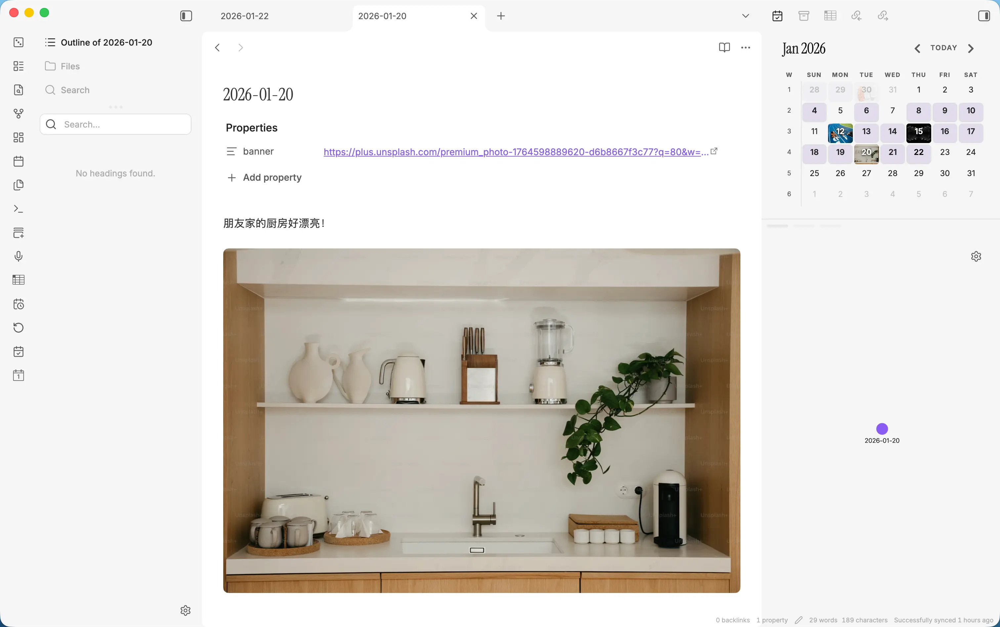
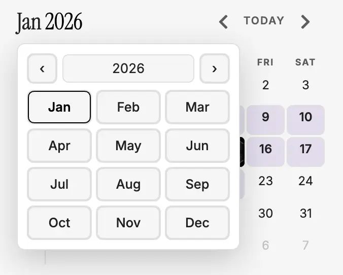
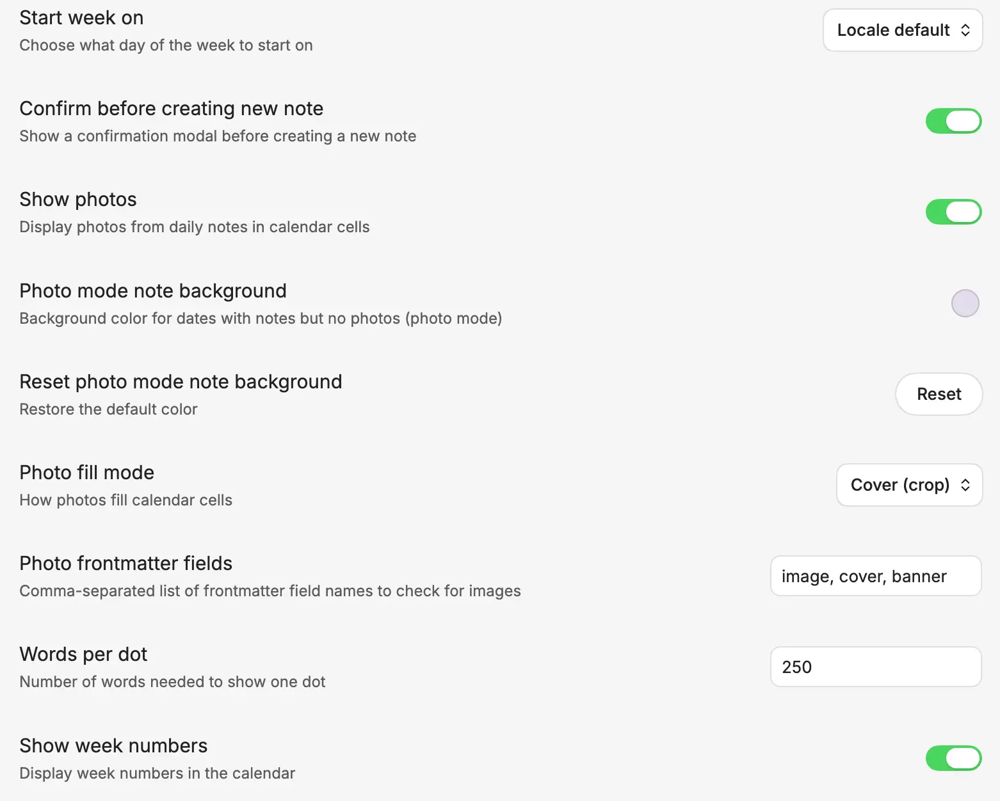

# Photo Calendar

[English](./README.md) | [中文](#)

一个为 Obsidian 设计的日历插件，可以将日记中的照片显示为日历背景。

## 功能特性

- **照片模式**：将日记 frontmatter 中的照片显示为日历单元格背景
- **照片模式笔记底色**：对有笔记但没有照片的日期设置自定义背景色
- **跨月日期照片**：当前月之外的日期格也会显示照片
- **月份选择器**：点击日历标题即可跳转到任意月份和年份
- **照片填充模式**：支持 Cover（裁切）或 Contain（适配）显示照片
- **字数指示器**：标准模式下通过圆点数量直观显示笔记长度（可自定义每个圆点代表的字数）
- **周日记支持**：点击周数字创建或打开周日记
- **日记集成**：点击日期打开或创建日记
- **可配置**：自定义周起始日、照片来源字段和显示偏好

## 效果截图

**插件视图**


**完整视图（含日记）**


**月份选择器**


**设置面板**


## 安装

### 手动安装

1. 下载最新版本
2. 解压文件到你的仓库插件目录：`<vault>/.obsidian/plugins/photo-calendar/`
3. 重新加载 Obsidian
4. 在设置 → 社区插件中启用本插件

### 开发

```bash
# 安装依赖
npm install

# 构建插件
npm run build

# 开发时监听文件变化
npm run dev
```

## 使用方法

在日记的 frontmatter 中添加图片引用：

```yaml
---
image: "[[photo.jpg]]"
---
```

插件支持 wikilinks、URL 和相对路径。可以在设置中配置要检查的 frontmatter 字段（默认：`image`、`cover`、`banner`）。

## 设置选项

- **显示照片**：切换照片显示模式
- **照片模式笔记底色**：设置无照片笔记的背景色（照片模式）
- **重置照片模式底色**：恢复默认背景色
- **照片填充模式**：Cover（裁切）或 Contain（适配）
- **周起始日**：选择区域默认、周日或周一
- **显示周数字**：显示周数字以便导航到周日记
- **照片 Frontmatter 字段**：自定义要检查的图片字段
- **每个圆点的字数**：配置每个圆点代表的字数
- **创建前确认**：创建新笔记前显示确认对话框

## 致谢

本插件的功能灵感来自：
- [obsidian-calendar-plugin](https://github.com/liamcain/obsidian-calendar-plugin) - 日历界面和日记集成
- [notebook-navigator](https://github.com/lizard-heart/notebook-navigator) - 照片作为日历背景的显示方式

## 许可证

MIT
